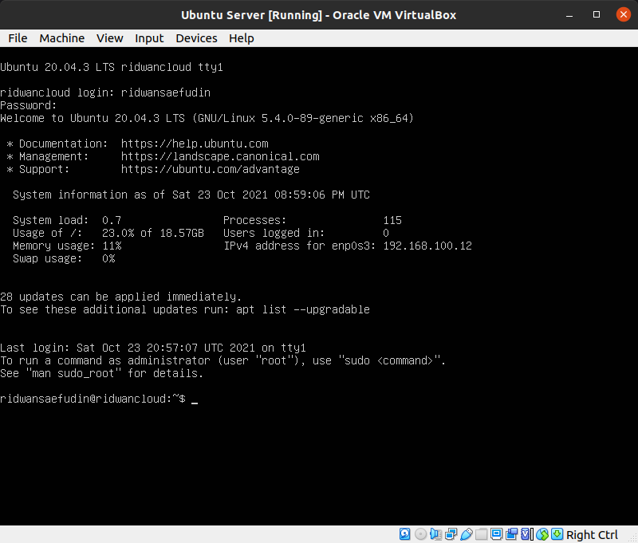

# VMware - Install Ubuntu Server
## Install Ubuntu Server 20.x with Virtualbox 
**1. Download Virtualbox, dan juga Ubuntu Server ISO** 
**2. Install Virtualbox, kemudian jalankan Virtualbox** 
**3. Buat Virtual Machine baru dengan mengklik tombol new** 
**4. Masuk ke halaman Create Virtual Machine dan tentukan nama, lokasi folder dan juga tipe OS yang akan digunakan, setelah selesai klik next** 
   
**5. Masuk ke Memory Size dan tentukan RAM yang akan digunakan, lalu pilih next** 
   
**6. Masuk ke Hard disk, dan pilih Create a virtual hard disk now, pilih create** 
   
**7. Masuk ke Hard disk file type dan pilih VDI(Virtualbox Disk Image), selanjutnya next** 
   
**8. Pilih Dynamicallu allocated, agar mudah mengalokasikan storage secara dinamis, klik next**
   
**9. Tentukan besaran memory hard disk yang akan digunakan, selanjutnya next** 
   
**10. Klik Virtual Machine yang telah dibuat dan pilih setting** 
   
**11. Pilih Storage dan masukkan file ISO ubuntu server pada Controller:IDE selanjutnya klik ok** 
   
**12. pilih Ubuntu Server dan pilih tombol start, otomatis ubuntu server siap dijalankan** 
**13. Masuk ke halaman awal dalam installasi ubuntu server dan tentukan language yang akan digunakan, selanjutnya tekan ENTER** 
   
**14. Tentukan Identify Keyboard yang akan digunakan, selanjutnya pilih done** 
   
**15. Setting IP address yang akan digunakan, DHCP untuk address secara otomatis, dan manual untuk setting ip secara static** 
   
**16. Masukkan IP Subnet, address, gateway, serta DNS yang akan digunakan dan pilih save, selanjutnya pilih next**
   
**17. Masuk ke proxy address, kita biarkan saja dan pilih Done**
   
**18. pilih Done** 
   
**19. Masuk ke storage layout dan pilih custom storage untuk mengcustom storage secara manual, pilih Done**
   
**20. Setting alokasi memory yang digunakan, saya menentukan 1GB untuk swap dan sisanya saya tentukan ke dalam root, selanjutnya pilih Done** 
   
**21. Tentukan nama, username serta password yang akan digunakan, selanjutnya pilih Done** 
  
   
**22. Centang OpenSSH server untuk dapat terkoneksi secara remote, selanjutnya pilih Done** 
   
**23. Tunggu hingga proses Installasi Ubuntu Server selesai, setelah itu pilih reboot untuk melakukan restart pada komputer** 
   
**24. Setelah selesai akan masuk ke tampilan login Ubuntu Server, lalu masukkan username dan password yang sebelumnya telah dibuat dan ubuntu server siap untuk digunakan** 
   