# VMware-Setup-Network
## Change Network from NAT to Bridge
**1. Buat Virtual Machine atau jika sudah ada buka virtual machine** 
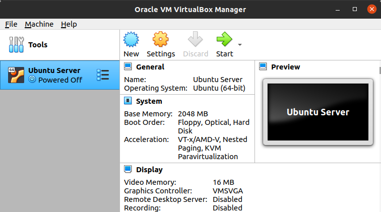   
**2. Masuk ke halaman Settings, Pilih Network, diberitahukan ada sebuah adapter yang terkoneksi ke jaringan NAT, pilih attached to dan ganti ke jaringan Bridge Adapter, selanjutnya pilih ok** 
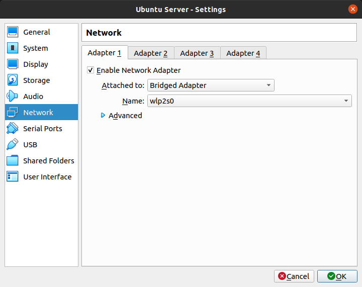   
**3. Masuk dan jalankan ubuntu server, tunggu hingga muncul halaman awal ubuntu server dan masukkan username dan juga password**
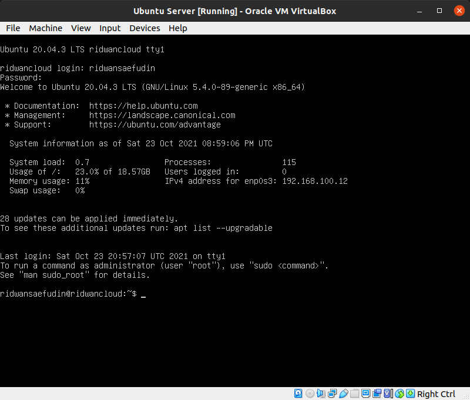   
**4. jalankan perintah `sudo apt-get update && sudo apt-get upgrade` untuk mengecek update terbaru dan juga upgrade repositori terbaru agar aman digunakan** 
**5. disini saya membuat sebuah user baru dengan perintah `sudo adduser <username>` untuk membuat user baru dan menentukan password yang digunakan** 
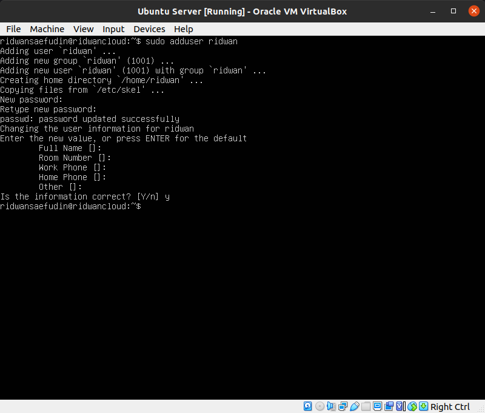   
**6. ketikan perintah `usermod -aG sudo <username>` untuk menambahkan user ke group sudo, atau dengan perintah `sudo nano /etc/sudoers` dan ketik `<username> ALL=(ALL:ALL) ALL` di dalam file, lalu tekan `CTRL+X` dan ketikkan y lalu ENTER, otomatis group sudo sudah ditambahkan ke dalam user baru** 
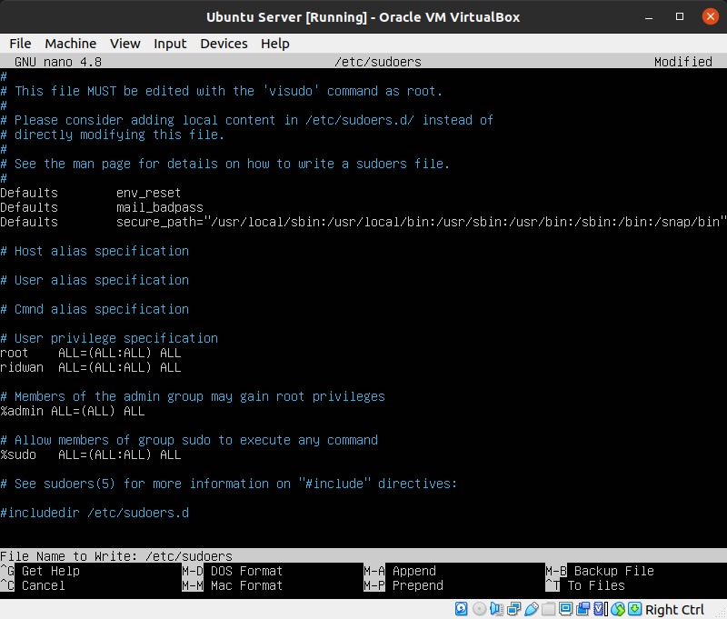   
**7. Uji akses sudo dengan perintah `su - <username>`** 
**8. Masukkan user dan password baru yang telah sebelumnya dibuat** 
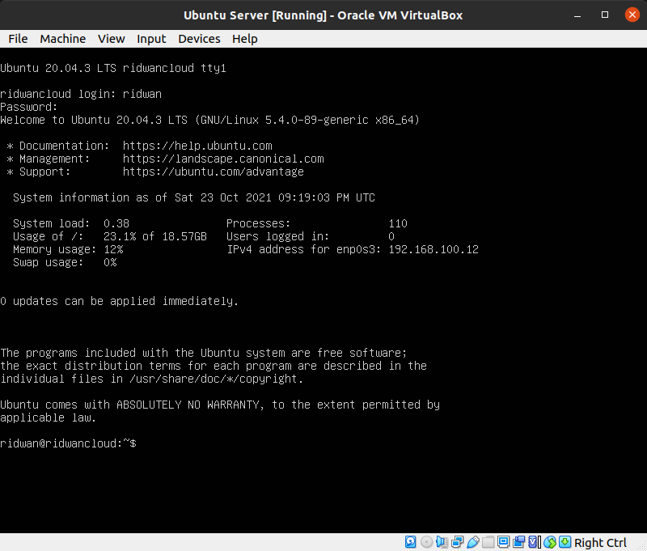   
**9. ping ke alamat google dengan perintah `ping www.google.com`** 
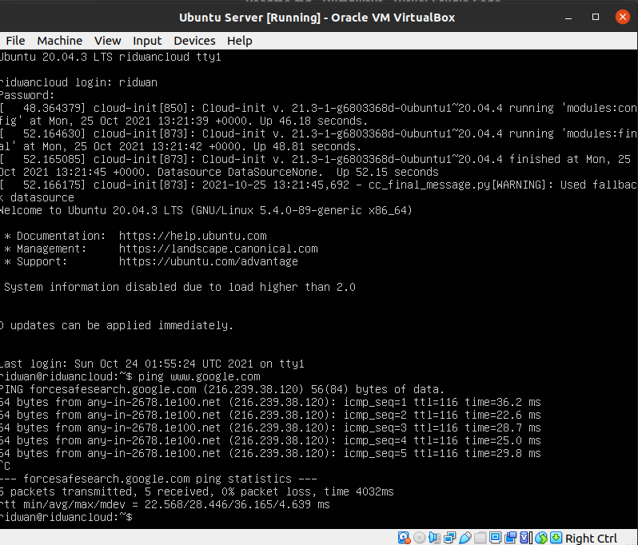   
**10. jalankan perintah `sudo apt-get install net-tools` dan ketikkan perintah `ifconfig` yang akan digunakan untuk melihat interface dan IP Address secara terperinci** 
**11. ketikkan perintah `sudo nano /etc/netplan/00-installer-config.yaml` untuk mengkonfigurasi alamat ip dan menentukkan IP Address yang ingin dirubah dan dijadikan static** 
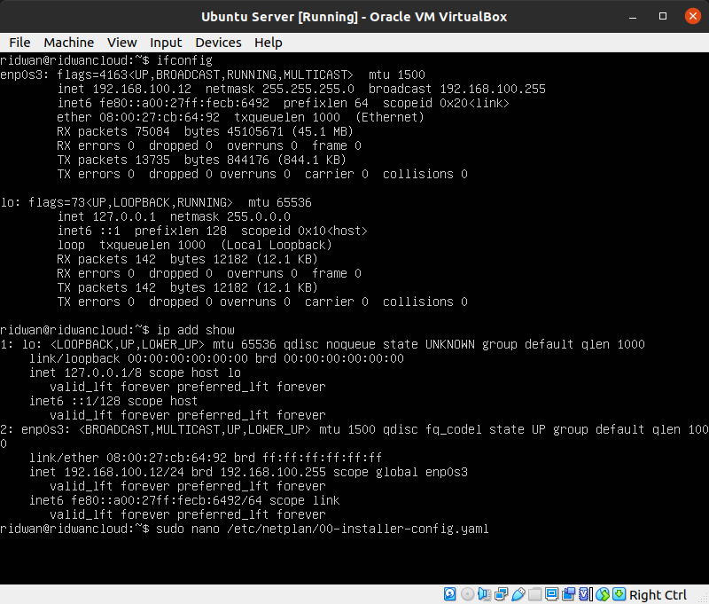   
**12. Masuk ke dalam file `/etc/netplan` dan ubah/setting alamat IP Address yang ingin digunakan, selanjutnya tekan `CTRL+X` dan ketik y, lalu tekan ENTER untuk menyimpan alamat IP yang sudah diubah** 
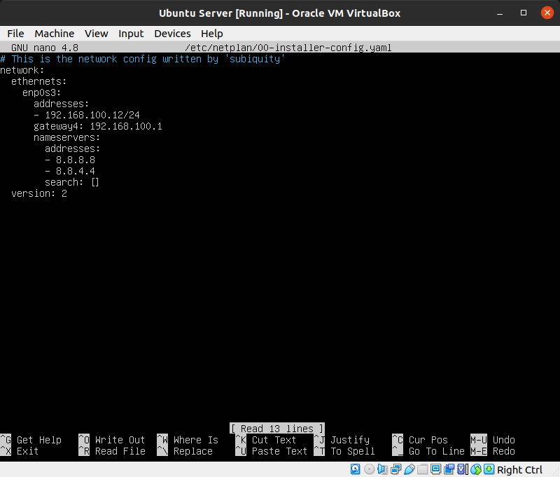   
**13. ketikkan perintah `sudo netplan apply` untuk mengkonfigurasi alamat yang telah diubah sebelumnya dan ketikkan perintah `reboot` untuk merestart system** 
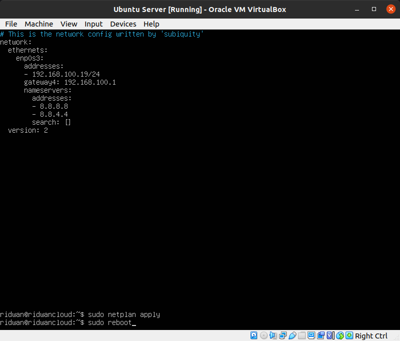   
**14. login kembali dan ketikkan perintah `ifconfig` untuk melihat alamat IP Address yang telah diubah** 
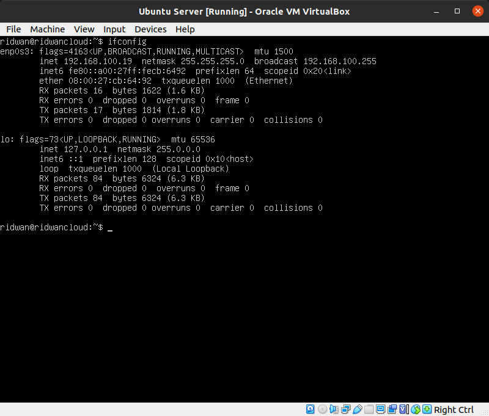   
**15. tes koneksi dengan perintah ping, untuk mengetahui apakah IP tidak bermasalah dan bisa digunakan**
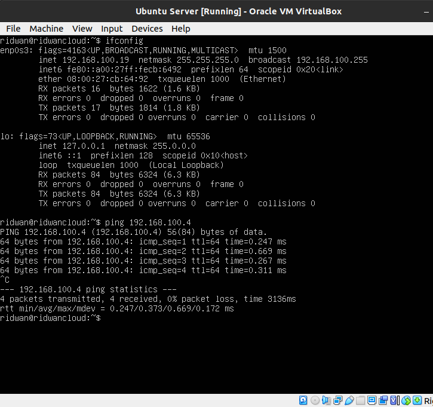  
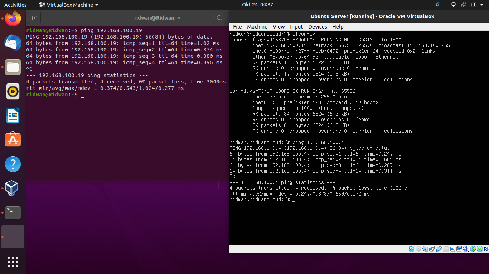   