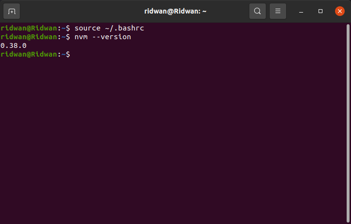

# VMware-Install-Application
## Update and Upgrade the System operation

**1. Jalankan VMware/Virtualbox yang telah terinstall OS Ubuntu Server** 
**2. Buka terminal dan login ke dalam server menggunakan ssh** 
   
**3. Jalankan perintah `sudo apt update` dan `sudo apt upgrade` untuk memperbaharui basis data paket dan mengupgrade repository/data paket** 
   
**4. Tunggu hingga prosesnya berjalan dan selesai**  

## Install NodeJS versi 10.x
**1. Jalankan perintah untuk update dan upgrade system** 
**2. Install NodeJS menggunakan nvm, karena nvm menyediakan opsi untuk kemudahan installasi NodeJS**
**3. Buka terminal dan jalankan perintah `wget -qO- https://raw.githubusercontent.com/nvm-sh/nvm/v0.38.0/install.sh | bash`** 
   
**4. jalankan perintah `source ~/.bashrc` untuk mereload dan cek versi nvm dengan perintah `nvm --version`** 
   
**5. Jalankan perintah `sudo apt install nodejs` untuk menginstall node js, tunggu hingga selesai dan cek versi dari NodeJS dengan perintah `node -v`** 
   
**6. ataupun bisa dilakukan dengan cara menginstall NodeJS menggunakan PPA. jalankan perintah `curl -sL https://deb.nodesource.com/setup_14.x -o nodesource_setup.sh` untuk menginstall versi NodeJS terbaru dan periksa skrip yang sudah diunduh dengan perintah `sudo nano nodesource_setup.sh` bila berhasil dan aman dijalankan ketikkan perintah `sudo bash nodesource_setup.sh` dan install aplikasi node js dengan perintah `sudo apt install nodejs`** 
   
**7. Install aplikasi git dengan perintah `sudo apt install git` untuk mengatur fungsi dari source code atau mengclone aplikasi yang di inginkan. lalu Cek versi terbaru dari NodeJS dan juga git** 
   
**8. jalankan perintah `sudo apt install nginx` yang berfungsi untuk Load Balancer,dan Server Proxy untuk aplikasi**
   
**9. Cek apakah nginx sudah berjalan dnegan perintah `sudo systemctl status nginx`**
   

## Clone application
**1. Setelah installasi NodeJS berhasil dan aplikasi yang dibutuhkan sudah terinstall. selanjutnya proses deploy application** 
**clone aplikasi yang sudah siap [https://github.com/sgnd/dumbplay-frontend](https://github.com/sgnd/dumbplay-frontend)** 
**3. Ketikkan perintah `git clone https://github.com/sgnd/dumbplay-frontend`**
   

## Change directory to frontend and deploy the application
**1. lihat folder yang sudah di clone sebelumnya dengan perintah `ls` dan masuk direktori apps dengan perintah `cd dumbplay-frontend`** 
   
**2. ketikkan perintah `cat package.json` untuk melihat semua isi paket lalu install package dan mengetik perintah `npm install` untuk menginstall dependency yang dibutuhkan oleh apps.** 
   
**3. Setelah selesai run apps dengan perintah `npm run start`** 
   
**4. Apps sudah berjalan, kemudian buka browser dan arahkan ke alamat server dengan port 3000 [192.168.100.4:3000](http://192.168.100.4:3000/)** 
   

## Deploy apps menggunakan nginx dan reverse proxy
**1. Masuk ke direcroty nginx dengan perintah `cd /etc/nginx` dan buat folder untuk konfigurasi website dengan perintah `sudo mkdir dumbplay`** 
   
**2. Ubah owner folder `sudo chown ridwan:ridwan dumbplay`, sehingga tidak perlu lagi menggunakan sudo untuk merubah isi folder** 
   
**3. masuk ke folder `dumbplay` kemudian buat sebuah file konfigurasi** 
**4. Ketikkan perintah `sudo nano dumbplay.xyz` (nama konfigurasi file sesuaikan dengan kebutuhab)** 
**5. Masuukan kode berikut** 
   
**6. Menggunakan port `80`, kemudian server_name `dumblay.xyz`, dan juga lokasi untuk mengarahkan ke apps `proxy_pass http://localhost:3000` save konfurasi dengan mengetik `CTRL + X` dan simpan** 
**7. Selanjutnya masuk ke folder nginx, edit file `nginx.conf` lalu ketikkan perintah `sudo nano nginx.conf`** 
   
**8. include konfigurasi dumbplay tadi ke dalam nginx.conf `include /etc/nginx/dumbplay/*;` lalu save dengan mengetik `CTRL + X`** 
   
**9. Check konfigurasi dengan perintah `sudo nginx -t` untuk memastikan system konfigurasi tidak ada yang error. lalu mereload nginx dengan perintah `sudo systemctl reload nginx`** 
   
**10. Masuk ke folder aplikasi `dumbplay-frontend` kemudian run apps dengan perintah `npm run start`.**
   
**11. Agar bisa mengakses `dumbplay.xyz`, tambahkan ip server virtual machine dan web url nya ke komputer kita.** 
**12. Buka terminal baru(bukan di virtual machine), ketik perintah `sudo nano /etc/hosts` lalu save** 
   
**13. Buka browser dan arahkan ke `dumbplay.xyz`**
   

## Install PM2 untuk apps bisa run di background
**1. Masuk ke terminal server dan install pm2 `npm install pm2 -g`** 
**2. Masuk ke dalam folder app dumbplay-frontend** 
**3. Jalankan ecosystem file yang ada dalam folder** 
**4. Ketikkan perintah `pm2 start ecosystem.config.js`** 
   
**5. Apps telah berjalan di background.**