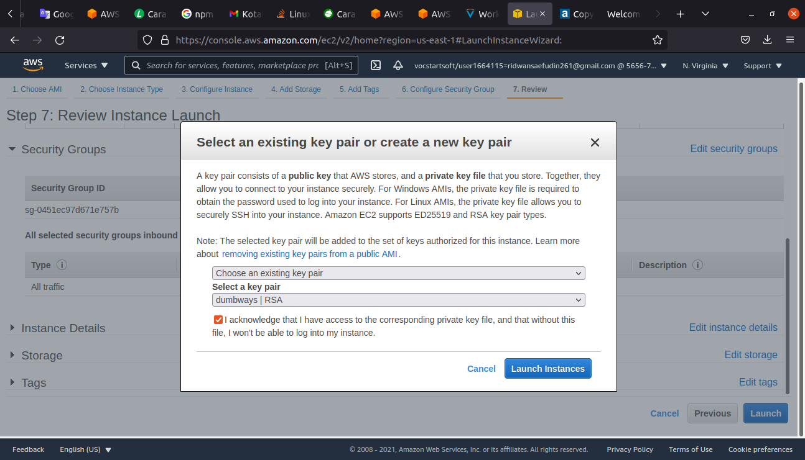

# Create and Setup Server
## Requirements:
* Create a server with ubuntu 20.x OS.
* Create two servers for reverse proxy and application with AWS.
* Server for revere proxy need a public IP Address.
* Server for the application only has a private IP Address.
* Setup security group and open ports 22,80,and 443 for reverse proxy.
* Setup security group and open all traffic for the application.

## Server Untuk Reverse Proxy
**1. Login ke dalam AWS Educate** 
   
**2. Pilih AWS Console, lalu pergi ke alamat link yang dituju** 
   
**3. Masuk ke halaman dashboard atau AWS Management console.** 
   
**4. Klik Launch a virtual machine** 
**5. Pada step 1 Choose an Amazon Machine Image(AMI), pilih Ubuntu Server 20.x**
   
**6. Step 2 pillih instance type sesuai kebutuhan, lalu klik next** 
   
**7. Step 3 Configure instance pilih Auto-assign public ip dan jadikan disable, lalu klik next** 
   
**8. Step 4 Add Storage, atur storage yang dibutuhkan, selanjutnya klik next** 
   
**9.Step 5 Tags biarkan saja default.** 
   
**10. Step 6 Setup Security Group. Create a new security group dan tentukan type yang diinginkan, disini setting untuk SSH, HTTP, dan HTTPS, selanjutnya klik reviee** 
   
**11. Step 7 Review Instance Lauch, biarkan saja, dan pilih Launch**
   
**11. Download key pair untuk digunakan login ke server nanti, lalu pilih Launch Instance.** 
   

### Allocate Elastic IP
**1. Masuk ke Elastic IPs yang terletak pada sidebar console bagian network & security.** 
   
**2. Kemudian Allocated Elastic IP address, AWS akan mengalokasikan sebuah IP yang dapat digunakan.** 
   
**3. Beri nama kemudian associate elastic ip address dengan server yang dituju** 
  
   
**4. Masuk ke instance kemudian refresh instances.** 
   
**5. Buka terminal, masuk ke direktori Documents dengan perintah `cd Documents`,  lalu buat directory baru dengan perintah `sudo mkdir /DumbWays/aws`**
   
**5. masuk ke dalam direktori aws dan lakukan perintah `chmod 400` untuk mengubah hak akses pada key pair `dumbways.pem`.** 
**6. Server bisa diakses melalui SSH menggunakan ip public.** 
  
   

## Server untuk Apps
**1. Login ke dalam AWS Console** 
**2. Masuk ke halaman dashboard atau AWS Management Console.** 
**3. Klik Launch a Virtual Machine** 
   
**4. Pada Step 1 Choose AMI cari ubuntu, kemudian pilih ubuntu server 20.** 
   
**5. Step 2 pilih instance type sesuai kebutuhan.**
   
**6. Step 3 Configure instance pilih auto-assign public ip menjadi disable.** 
   
**7. Step 4 Add Storage.** 
   
**8. Step 5 Tags biarkan default.** 
   
**9. Step 6 Setup security group, setting menjadi All trafic** 
  
   
**10. Gunakan key pair yang sama pada reverse proxy, lalu pilih launch instance** 
   
**11. Allocate Elastic IP untuk server apps.** 
  
   
**12. Akses Server** 
   