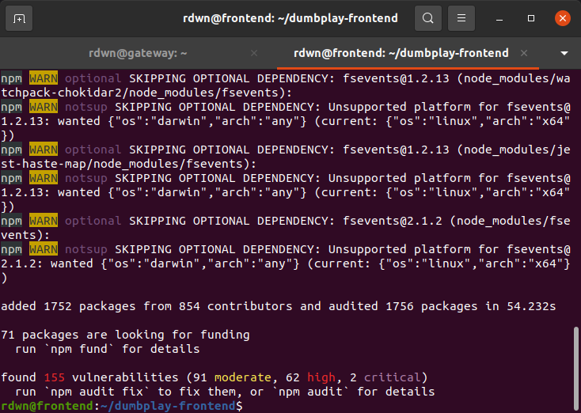
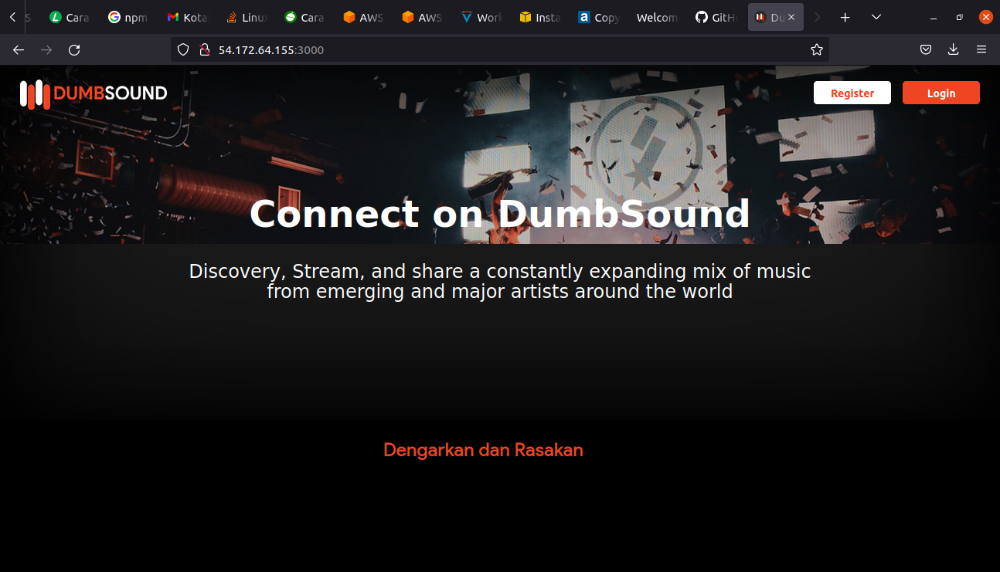

# AWS - Server for Application
## Requirement
* Update and Upgrade the System operation.
* Install node.js 10.x
* clone application in here [https://github.com/sgnd/dumbplay-frontend](https://github.com/sgnd/dumbplay-frontend)
* Change directory to **frontend** and deploy the application

### Update and upgrade sistem operasi
**1. Login ke app-server** 
**2. Update dan upgrade System `sudo apt update && sudo apt upgrade -y`** 
   

### Install NodeJS versi 14.x
**1. Install NVM untuk management NodeJS Version `wget -qO- https://raw.githubusercontent.com/nvm-sh/nvm/v0.34.0/install.sh | sudo bash`.** 
   
**2. Install nodejs versi 14.x, dengan perintah `nvm install 14`** 
   
**3. NodeJS telah terinstall.**

### Clone Application
**1. Clone apps dengan perintah `git clone https://github.com/sgnd/dumbplay-frontend`** 
   

### Deploy Application
**1. Masuk ke directory dumbplay-frontend.** 
**2. Ketik/jalankan perintah `npm install` untuk menginstall node_modules dan dependency apps.** 
   
**3. Deploy Apps, dengan perintah `npm run start`** 
**Buka Browser, arahkan url ke `54.172.64.155:3000`** 
   