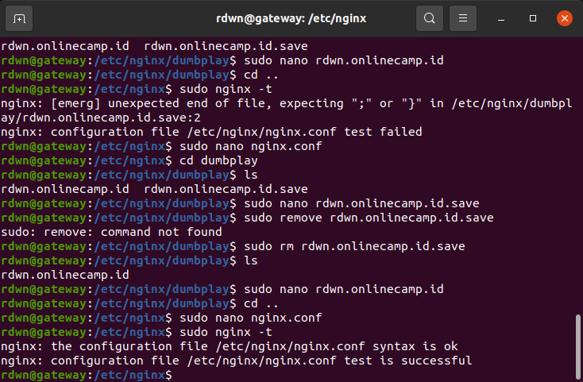

# AWS - Reverse Proxy
## Requirements
* Update and upgrade the operating system.
* Install Webserver for reverse proxy.
* Create revere proxy from the application with port 3000 to port 80  

**1. Login ke server reverse proxy** 
**2. Update dan upgrade sistem** 
   
**3. Install Nginx dengan perintah `sudo apt install nginx`** 
   
**4. Masuk ke dalam folder nginx dengan perintah `sudo nano /etc/nginx`** 
   
**5. Buat folder `dumbplay` untuk menyimpan file konfigurasi** 
   
**6. Masuk ke dalam folder dumbplay** 
**7. Buat file konfigurasi dengan perintah `nano dumbplay-config` kemudian buat aplikasi mengarah ke port 80.** 
   
**8. Kemudian include konfigurasi dumbplay tadi ke `nginx.conf`, save perubahan** 
   
**9. Test konfigurasi file, dengan perintah `sudo nginx -t`, untuk mengecek syntas konfigurasi apakah berjalan dengan baik.** 
   
**10. restart nginx dengan perintah `sudo systemctl resstart nginx`** 
**11. Selanjutnya arahkan domain name ke public ip reverse-proxy-server, untuk dapat berjalan di port 80, dan uncheck proxy status.** 
   
**12. Buka browser kemudian arahkan url ke `rdwn.onlinecamp.id` untuk mengunjungi website.** 
   