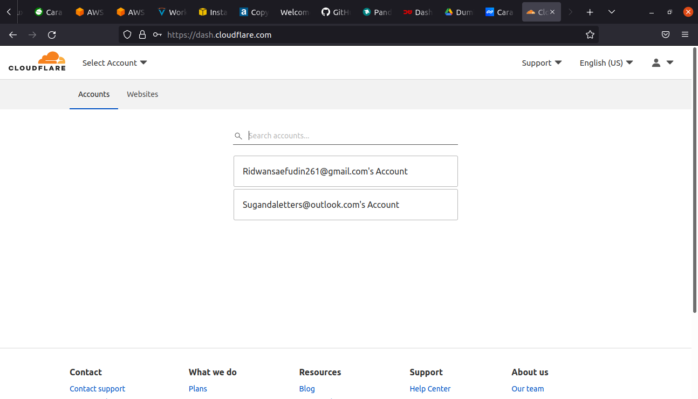
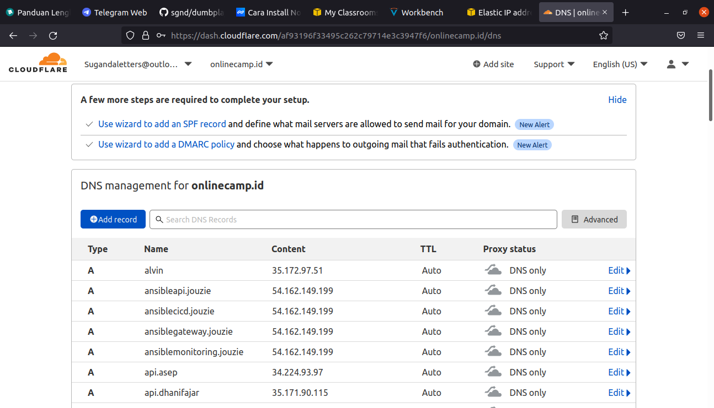

# 07. AWS - Custom Domain
### Create sub-domain
**1. Login ke penyedia nama domain, contoh yang akan digunakan disini yaitu cloudflare** 
   
**2. Pilih domain yang akan digunakan/ditambahkan sub-domain, misal `onlinecamp.id`** 
   
**3. Masuk ke menu DNS** 
   
**4. Untuk menambahkan sub-domain, klik Add Record, pastikan jika sub-domain yang diinginkan tersedia.** 
**5. Set type A untuk IPv4, lalu masukkan ip public server reverse proxy atau gateway-nya, check proxy jika ingin menggunakan proxy.** 
   
