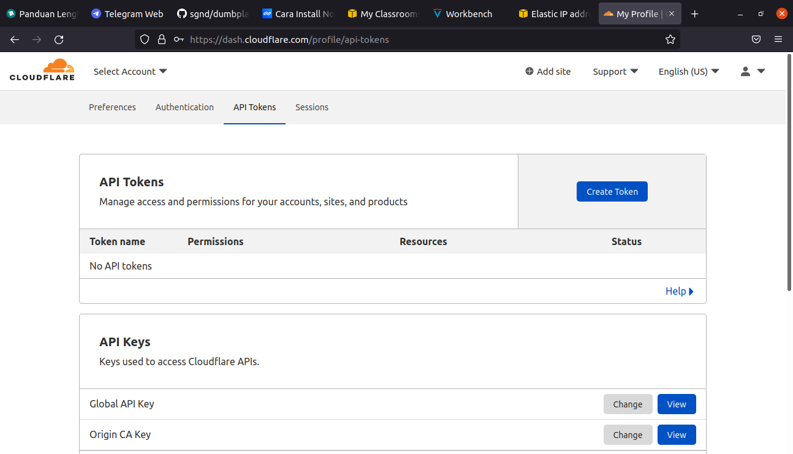
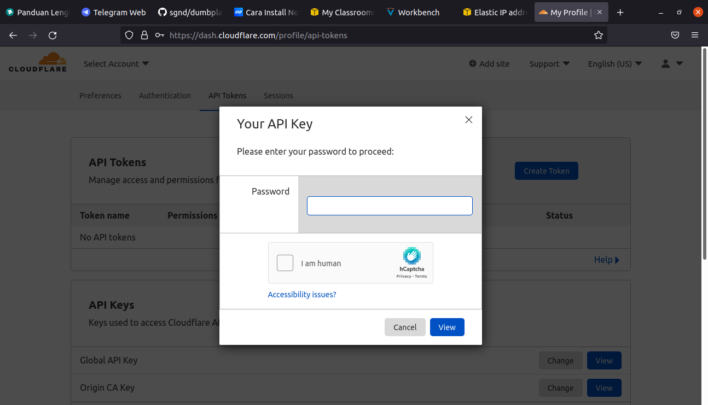
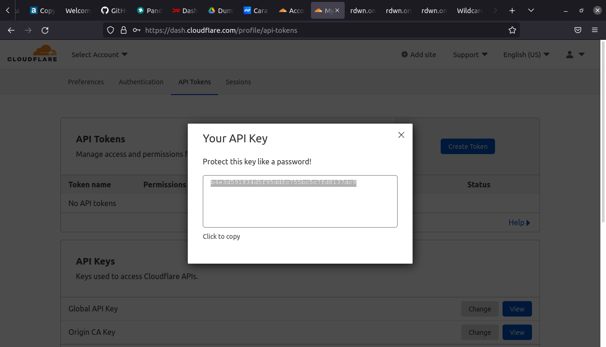
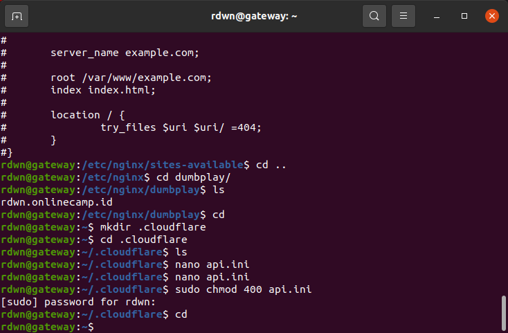
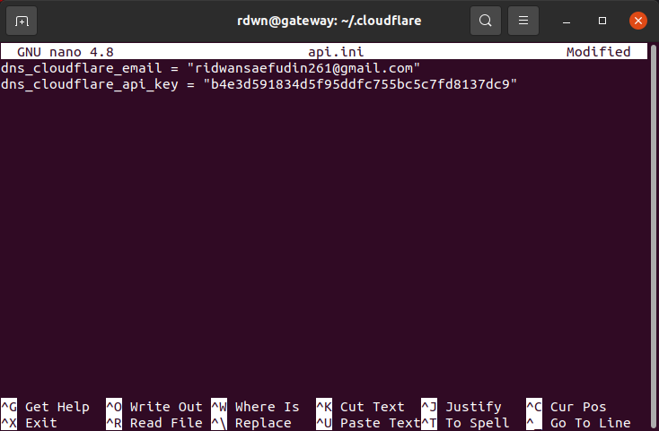
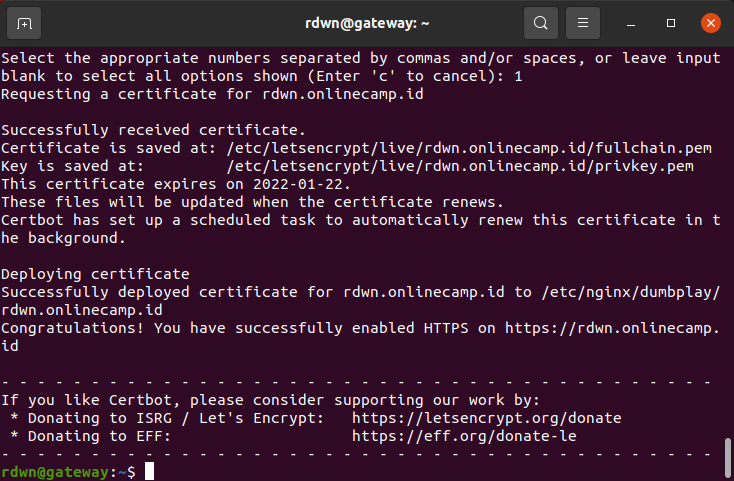
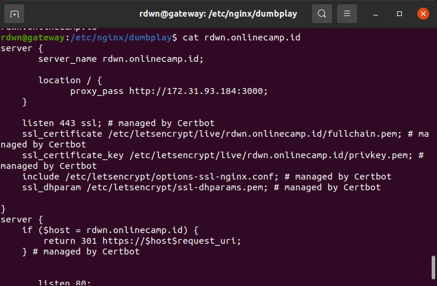
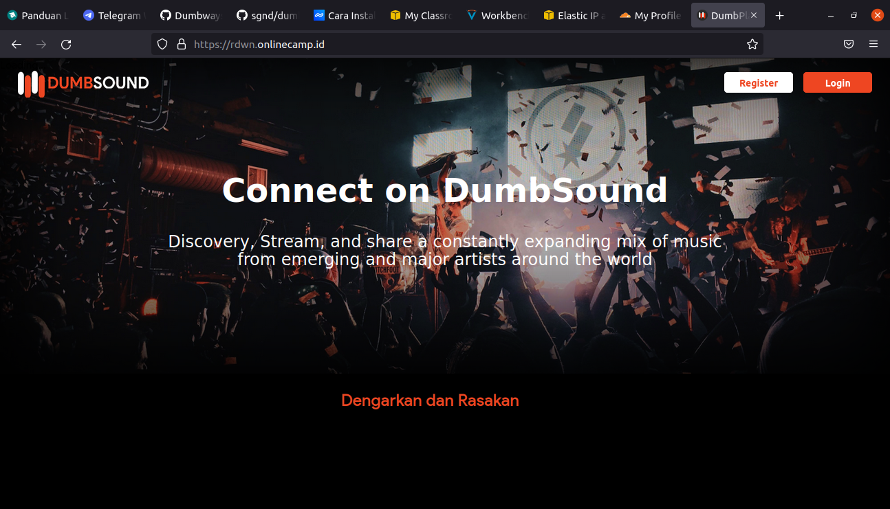

# AWS - SSL Configuration
### Generate API Key
**1. Login dan masuk ke dashboard cloudflare** 
**2. Pada bagian account klik my profile** 
**3. Masuk ke halaman API tokens.** 
   
**4. Pada bagian Global API Key, klik view, lalu akan muncul kotak dialog.** 
   
**5. Masukkan password untuk mendapatkan key.** 
**6. Copy dan simpan api key** 
   
**7. Login ke dalam server** 
**8. Buat folder kemudian di dalamnya buat file untuk menyimpan api key cloudflare.** 
   
**9. Di dalam file masukkan email dan juga api key, lalu simpan** 
   
**10. Setelah itu ubah hak akses folder ke 700 dan file 400.** 
   

## Install Certbot and the Cloudflare DNS authenticator plugin
**1. Update snapd `sudo snap install core; sudo refresh core`.** 
**2. Install certbot `sudo snap install --classic certbot`.** 
**3. Link certbot dari /snap/bin/certbot ke /usr/bin/certbot `sudo ln -s /snap/bin/certbot /usr/bin/certbot`**
**4. Generate SSL `sudo certbot`.** 
**5. masukkan email address** 
**6. kemudian Agree Terms of Service.** 
**7. pilih nama website yang akan dipakaikan HTTPS** 
**8. Tunggu request certificate untuk website berhasil generate.**
   
**9. Masuk ke folder config nginx untuk website `/etc/nginx/dumbplay`.** 
**10. Ketikkan perintah `cat dumbplay-config` untuk melihat perubahannya.** 
**11. kemudian test config `sudo nginx -t`** 
   
**12. Reload nginx `sudo systemctl reload nginx`** 
**13. Buka browser dan arahkan ke alamat url `rdwn.onlinecamp.id`** 
   