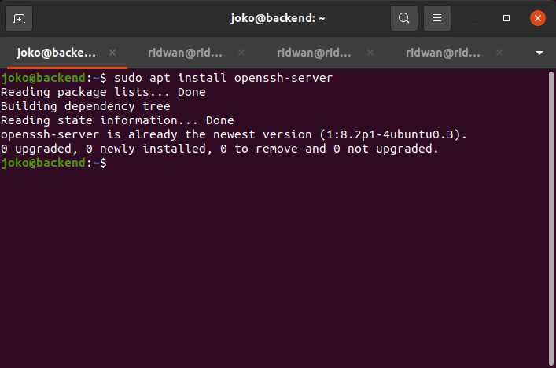

# Install Git dan SSH Key
## Fork repository backend apps
 

**1. Login ke akun Github.** 
**2. Buka repository backend apps yang akan di fork, `https://github.com/sgnd/dumbplay-backend`.** 
**3. Pada halaman repository backend apps,klik fork,maka akan otomatis akan masuk ke repository akun github kita.** 
   

## Buat SSH Key untuk Git
 

**1. Buat sebuah server/instance di AWS.** 
  
  
  
  
  
  
  
  
  
  
  
  
  
  
  
  
   

**2. Masuk kedalam server yang sudah dibuat sebelumnya, yaitu server backend dengan key** 
   
**3. melakukan update dan upgrade dengan perintah `sudo apt update & sudo apt upgrade`** 
  
   
**4. Install git dengan perintah `sudo apt install git`.** 
   
**5. Install SSH dengan perintah `sudo apt install openssh-server`** 
   
**6. Tambahkan user ke dalam config git.** 
**7. Jalankan perintah `git config --global user.name <username>`. kemudian jalankan perintah `git config --global user.email <email>`.** 
   
**8. Buat folder untuk menyimpan ssh key.** 
   
**9. Generate ssh key di dalam foder yang telah dibuat. lalu Jalankan perintah `ssh-keygen -t rsa -b 4096 -C "email"`.** 
**10. Masukkan nama file kemudian passphrase.** 
   
**11. Akan menghasilkan 2 key dan yang satunya berekstensi .pub (public).** 
   
**12. Tambahkan ssh key yang telah di generate tadi, dan ketikkan perintah `eval "$(ssh-agent -s)"` kemudian `ssh-add .git-ssh/git-ssh`.** 
   
**13. Selanjutnya masuk ke github account.** 
**14. Masuk ke settings, pada bagian Account settings buka SSH dan GPG Keys.** 
**15. Buat SSH Key, beri title kemudian copy-paste generated SSH key yang berekstensi `.pub` tadi. simpan kemudian masukkan password akun github.** 
   
**16. Kemudian test koneksi ke github, dengan perintah `ssh -T git@github.com`** 
   

## Git pull, push, dan merge pada server
**1. Git clone repository backend apps `git@github.com:ridwan094/git-dumbways.git`** 
**2. Buat sebuah branch `git branch development`** 
**3. Kemudian arahkan ke branch development `git checkout development`** 
   
**4. Ubah backend apps misal menambah atau menghapus file.** 
**5. Kemudian `git add .`** 
   
**6. Kemudian commit perubahan, jalankan perintah `git commit -m "perubahangit"`** 
**7. Kemudian push `git push origin development`** 
**8. Update branch dengan pull `git pull origin development`** 
**9. Merge branch git merge development production.**