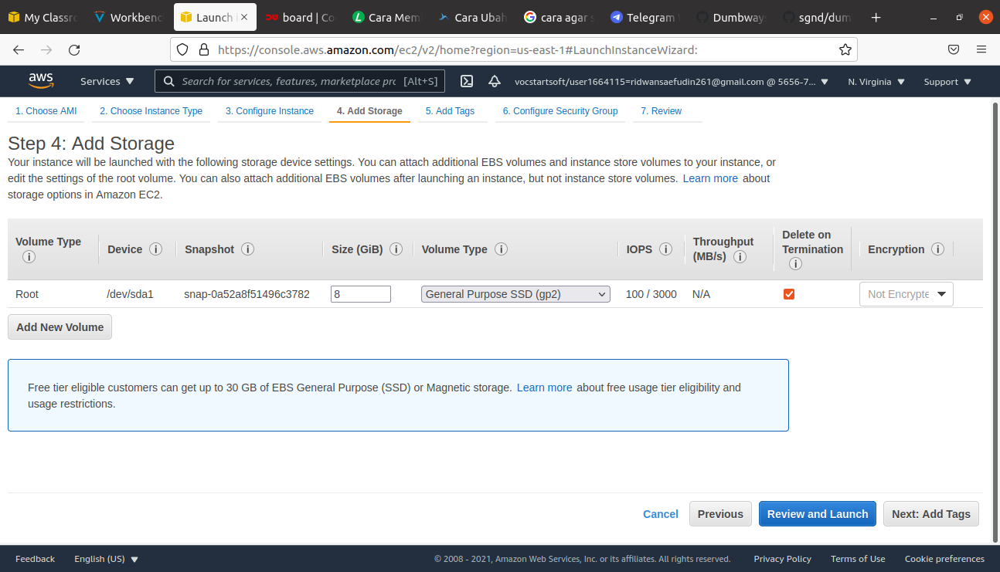
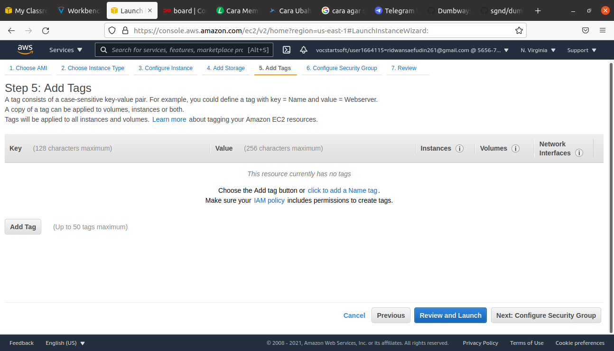

# Setup Databases
## Buat instance baru untuk backend
**1. Login ke AWS Console, pilih EC2** 
**2. masuk ke instance, lalu Lauch new instance** 
**3. Buat instance baru untuk database** 
  
  
  
  
  
  
  
  
  
  
  
  
   

## Install database
**1. login ke dalam server database** 
**2. jalankan perintah `sudo apt update & sudo apt upgrade`.** 
  
   
**3. Install mysql dengan menjalankan perintah `sudo apt install mysql-server`.** 
   
**4. Jalankan perintah `sudo systemctl status mysql` apakah sudah running.** 
   
**4. Konfigurasi keamanan database dengan perintah `sudo mysql_secure_installation`** 
**5. Input password dan pertanyaan keamanan.** 
   

## Database dapat terkoneksi dengan klien
**1. Buka folder `/etc/mysql/mysql.conf.d`, lalu edit file `mysqld.cnf`** 
  
   
**2. Ubah ip address `bind address` ke ip address yang dituju/yang diboolehkan, disini saya mengubah bin-address ke `0.0.0.0` publik** 
  
*Note* **:** **mysqlx-bind-address tidak perlu ditambahkan jika memang tidak ada, jika ditambahkan manual akan menyebabkan crash pada mysql service** 

**3. save** 
**4. Restart mysql service dengan perintah `sudo service mysql restart`.** 
   
**5. Selanjutnya adalah grant akses host.** 
**6. Login ke mysql server `sudo mysql -u root -p`** 
   
**7. Ketikkan perintah/commend berikut `GRANT ALL PRIVILEGES ON *.* TO 'root'@'%' IDENTIFIED BY 'password-user';`** 
  
   