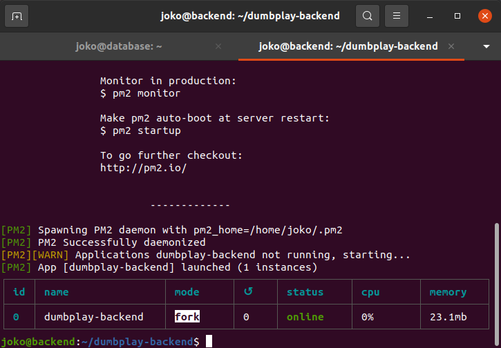

# Deployment Backend App
**1. Masuk ke dalam server backend, lalu clone backend apps** [https://github.com/sgnd/dumbplay-backend](https://github.com/sgnd/dumbplay-backend). 
  
**2. Buka Readme file di dalam folder backend.** 
  
**3. Kemudian jalankan requirementnya.** 
* Install nodejs
* Copy .env-copy .env
* Import database dengan sequelize
 

 
 
**Edit Config.json file sesuaikan database username, password, nama database dan host addressnya.** 
  

**4. lakukan secure copy untuk database dumbplay.sql dari server backend ke dalam server database. dengan perintah `scp -r dumbplay.sql host@ip:<tujuan>`** 
 
  

## Import Database dengan Sequelize
**1. Install sequelize-cli dnegan menjalankan perintah `npm install --save-dev sequelize-cli -g`** 
  
**2. Kemudian install sequelize `npm install --save sequelize`** 
**3. Install mysql2 `npm install mysql2 -g`** 
**4. Migrate database, dengan menjalankan perintah `sequelize db:migrate` atau `node_modules/.bin/sequelize db:migrate`** 
  
**5. Run backend apps dengan pm2 `pm2 start ecosystem.config.json`** 
  
  