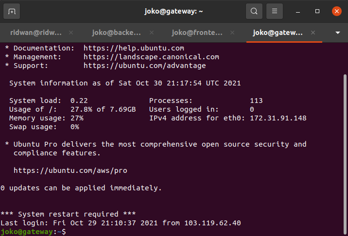
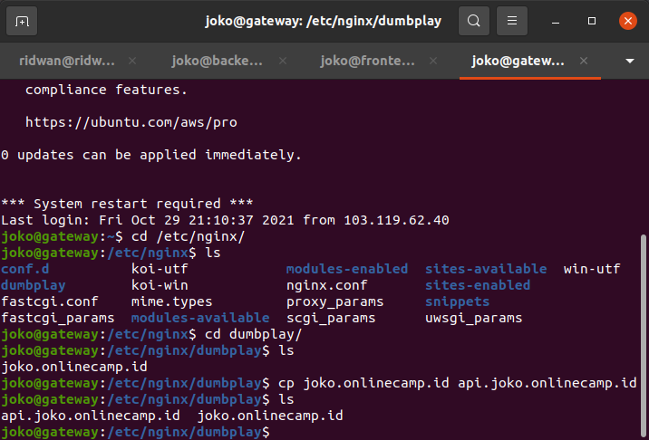
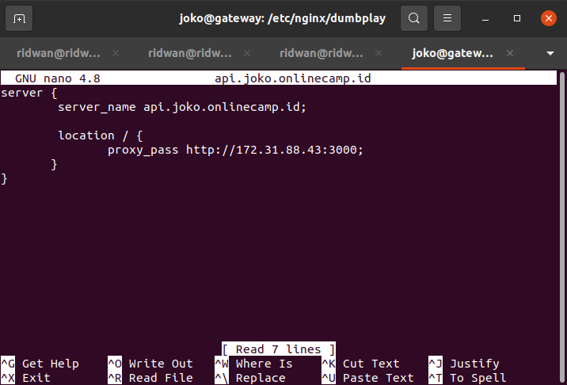

# Reverse Proxy for Backend Apps
**1. Login ke server gateway.** 
   
**2. Update dan Upgrade System.** 
**3. Install Nginx.** 
**4. Masuk ke folder /etc/nginx/dumbplay** 
**5. Kemudian buat file config untuk backend apps `api.joko.onlinecamp.id`** 
   
**6. Edit arahkan proxy_pass ke ip private server backend.** 
   
**7. Save.** 
**8. Test config file `sudo nginx -t` untuk memastikan tidak adanya error.** 