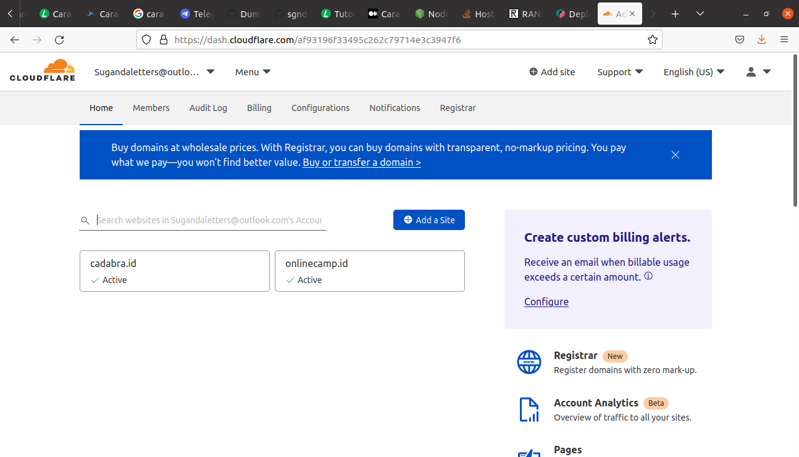
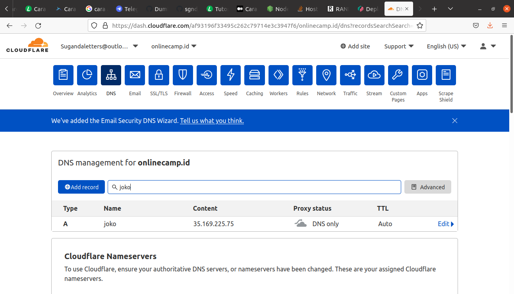
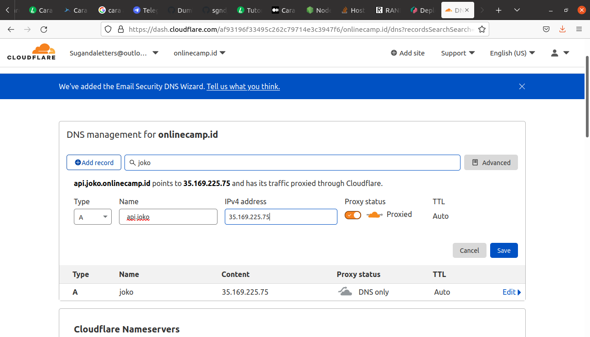

# Custom Domain for Backend
**1. Login cloudflare**
**2. Pilih akun `sugandaletters@outlook.com`** 
**3.Pilih domain `onlinecamp.id`** 
   
**4. Masuk ke menu DNS.** 
   
**5. Add record api.joko.onlinecamp.id** 
   
**6. Arahkan ke public ip gateway instance.** 
**7. Aktifkan proxy** 
**8. Save**