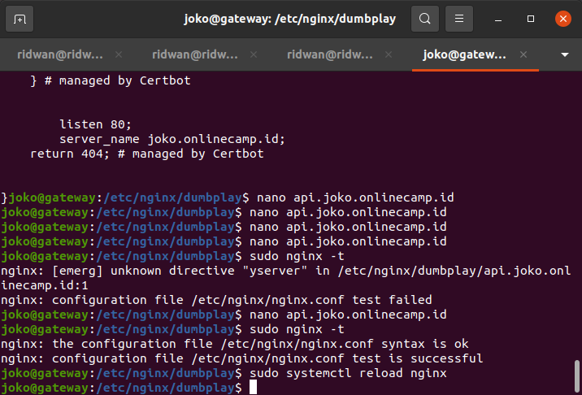

# SSL Configuration for Backend Apps
## Arahkan frontend api.js ke backend Apps
**1. Login ke server frontend** 
   
**2. Masuk ke folder `frontend/config`** 
   
**3. Edit file api.js arahkan `baseURL:` [https://api.joko.onlinecamp.id/api/v1](https://api.joko.onlinecamp.id/api/v1)** 
  
   
**4. Restart Apps,** 
   

## SSL Configuration
**1. Login ke instance/server gateway.** 
   
**2. Update dan Upgrade Sistem.** 
**3. Install Certbot untuk backend.** 
**4. Jalankan perintah `sudo certbot certonly -d api.joko.onlinecamp.id`** 
   
**5. Syntax penambahan SSL dari certbot.** 
   
**6. Test Konfigurasi `sudo nginx -t`** 
**7. Restart nginx `sudo service nginx restart`** 
   
**8. Buka website `joko.onlinecamp.id`** 
**9. Buat akun atau registrasi untuk testing koneksi ke backend.** 
   
   