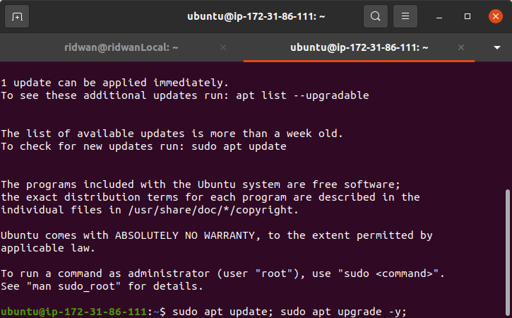
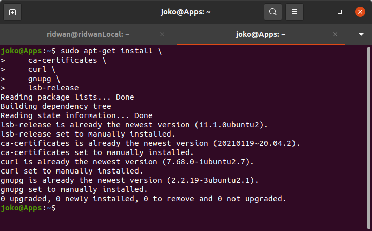
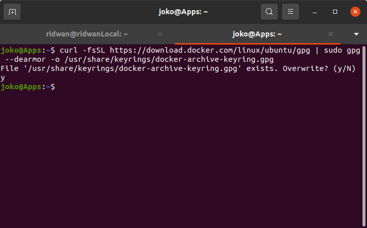
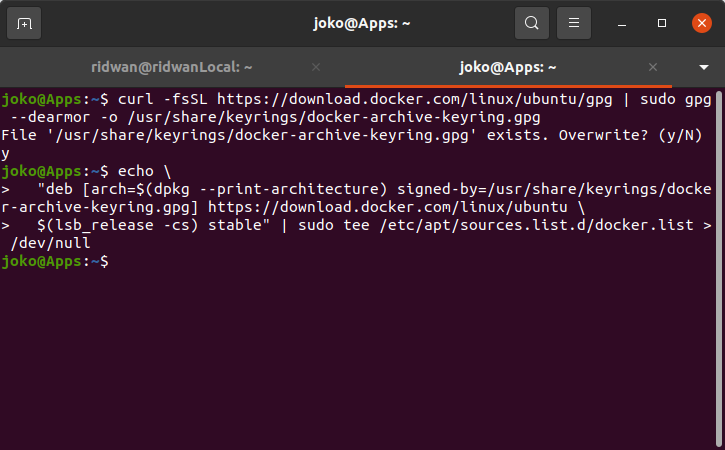
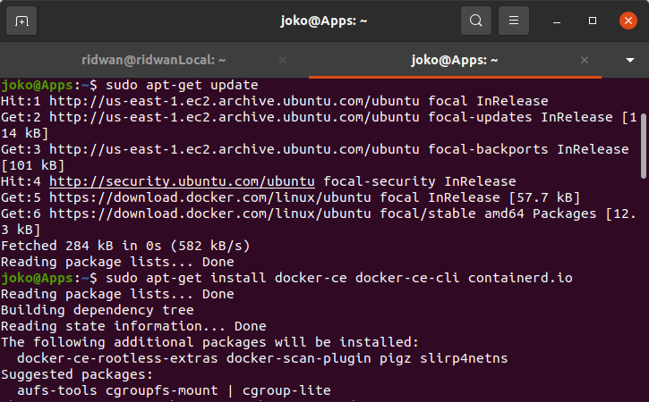
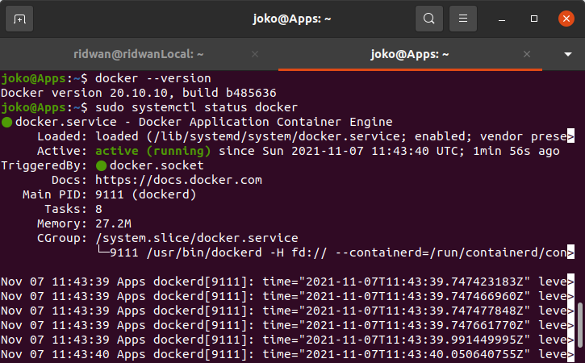
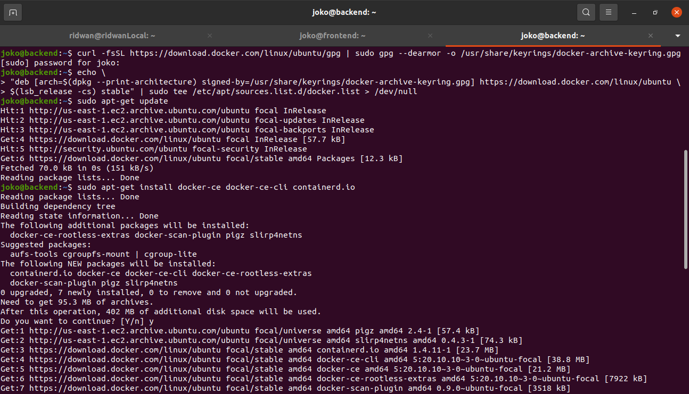
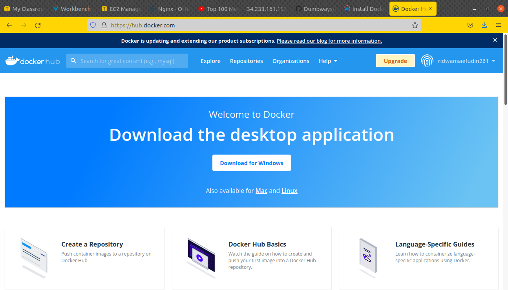
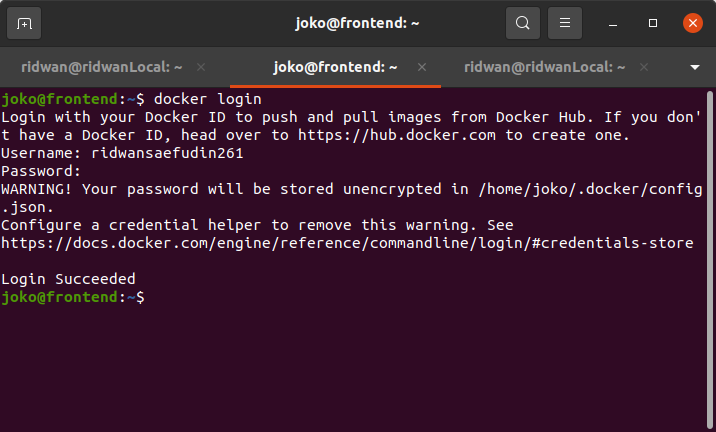

# Install Docker

## Install docker di server frontend dan backend  
**1. Login ke server frontend dan backend.** 
**2. Update dan Upgrade sistem.** 
   
**3. perbaharui apt untuk memungkinkan apt menggunakan repositori melalui Https** 
   
**4. Tambahkan GPG key docker. `curl -fsSL https://download.docker.com/linux/ubuntu/gpg | sudo gpg --dearmor -o /usr/share/keyrings/docker-archive-keyring.gpg`** 
   
**5. Tambahkan repository docker, bisa menggunakan yang stable atau nightly channel.`echo \ "deb [arch=$(dpkg --print-architecture) signed-by=/usr/share/keyrings/docker-archive-keyring.gpg] https://download.docker.com/linux/ubuntu \ $(lsb_release -cs) stable" | sudo tee /etc/apt/sources.list.d/docker.list > /dev/null`**  
   
**6. jalankan update sistem `sudo apt update`** 
**7. Install docker.`sudo apt-get install docker-ce docker-ce-cli containerd.io`**
   
**8. Cek versi dari docker, dan pastikan sudah berjalan.** 
   
**9. Untuk server backend, lakukan hal yang sama sesuai arahan dari step 1-7.** 
   

## Login ke docker hub
**1. masuk ke dalam website.** [hub docker](https://hub.docker.com/) 
**2. Buat akun docker di `hub.docker.com`** 
   
**3. Buka terminal atau masuk ke server, login docker menggunakan akun hub docker yang telah dibuat sebelumnya.** 
**4. jalankan perintah `docker login`** 
**5. Masukkan username dan password docker hub**
   