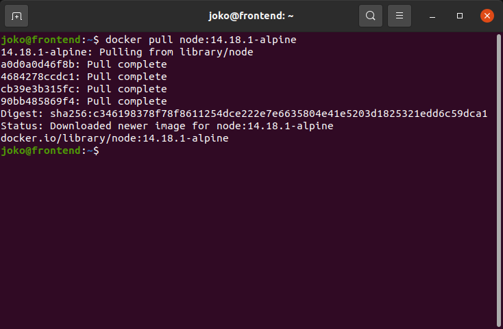
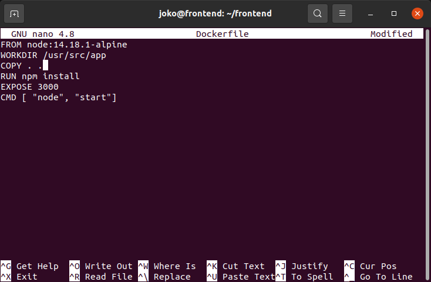
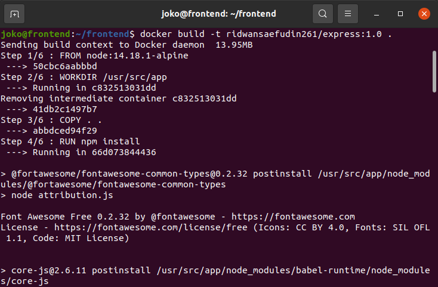
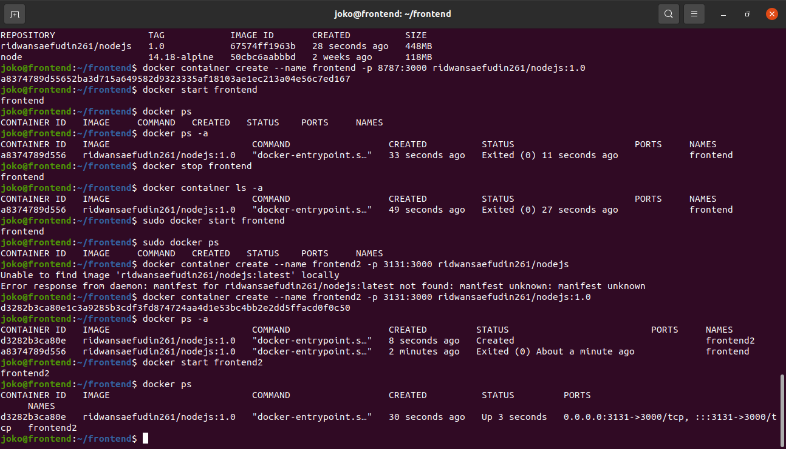
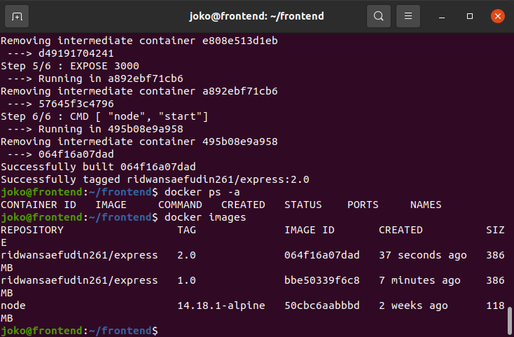
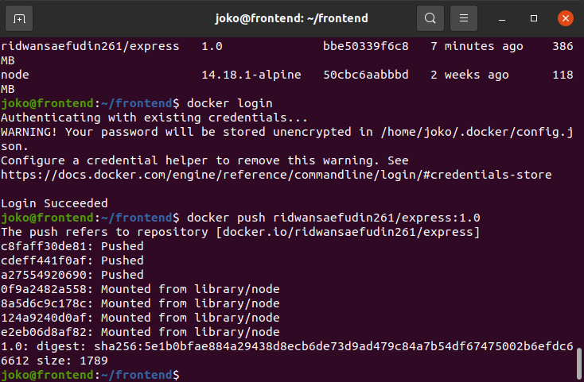
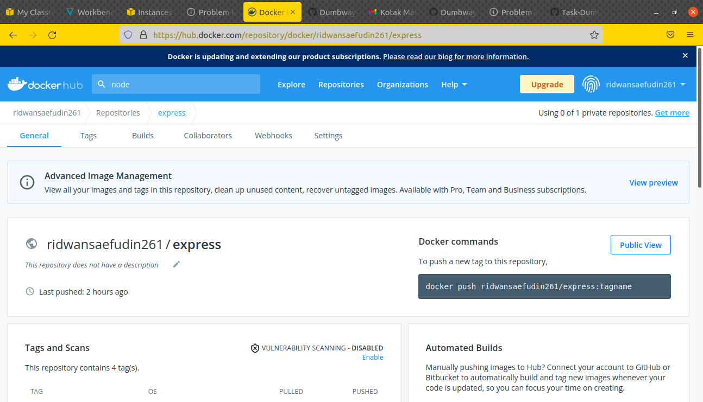

# Buat docker images
## Membuat docker images untuk frontend
 

**1. Login ke server frontend.** 
**2. Download images node js, dengan menjalankan perintah `docker pull node:14.18.1-alpine`** 
   
**3. Clone app frontend, `git clone https://github.com/sgnd/dumbplay-frontend.git`** 
**4. Masuk ke dalam folder dumbplay-frontend** 
**5. Buat docker file `sudo nano Dockerfile`** 
   
**6. Simpan.** 
**7. Buat docker image frontend app, `docker build -t nama-file:tag`**
   
**8. Buat container dari image frontend, `docker container create --name nama-container -p 3131:3000 nama-images:tag`** 
   
**9. Jalankan container `docker run nama-container`** 
**10. Push image ke repository docker hub** 
   
**11. Push repository di akun docker hub.** 
  
  
