# Install Jenkins
## Buat AWS Instance  
**1. Login ke akun AWS.** 
**2. Buat instance baru untuk jenkins.** 
**3. Login ke instance** 
**4. Update dan upgrade sistem** 
**5. Install Jenkins LTS.**  

## Install Jenkins versi Debian/Ubuntu  
**1. Install java `sudo apt install openjdk-8-jdk`** 
**2. Tambahkan apt repository jenkins `wget -q -O - https://pkg.jenkins.io/debian-stable/jenkins.io.key | sudo apt-key add -`** 
**3. Eksekusi kode berikut `sudo sh -c 'echo deb http://pkg.jenkins.io/debian-stable binary/ > /etc/apt/sources.list.d/jenkins.list'`** 
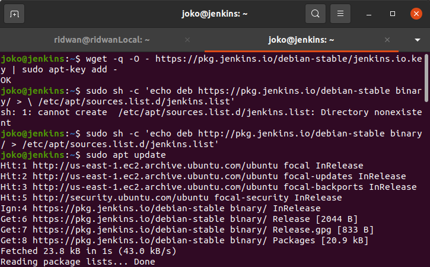   
**4. Update Sistem** 
**5. Install jenkins `sudo apt install jenkins`** 
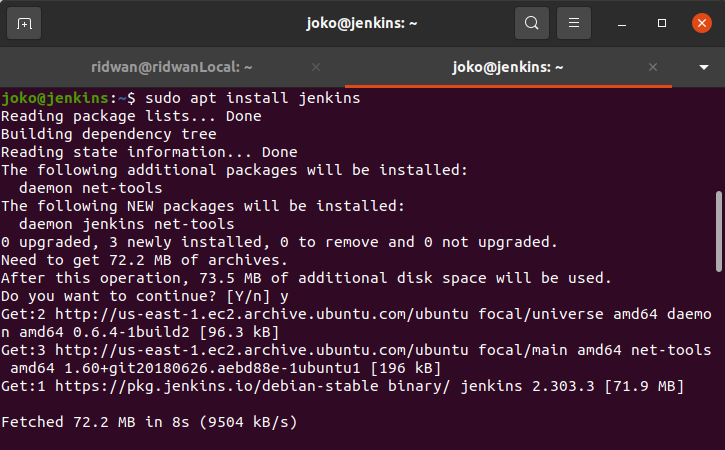   
**6. Buka browser dan arahkan ke `ip-address-server:8080`** 
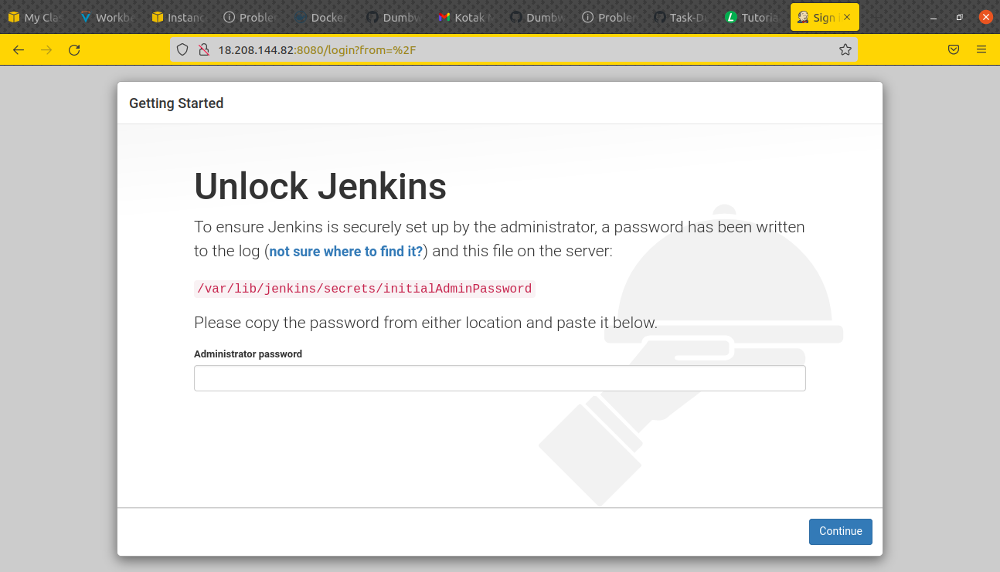   

## Setup Jenkins
**1. Akses halaman jenkins di port 8080** 
**2. Masukkan initial admin password, bisa dilihat di `sudo cat /var/lib/jenkins/secrets/initialAdminPassword`** 
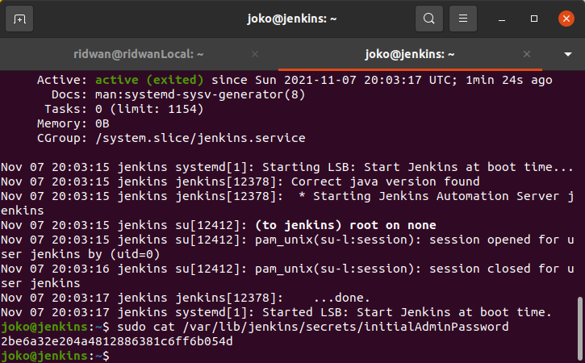   
**3. Pilih jenis instalasi plugin jenkins(pilih yang suggested plugins) dan tunggu proses instalasi plugin selesai.** 
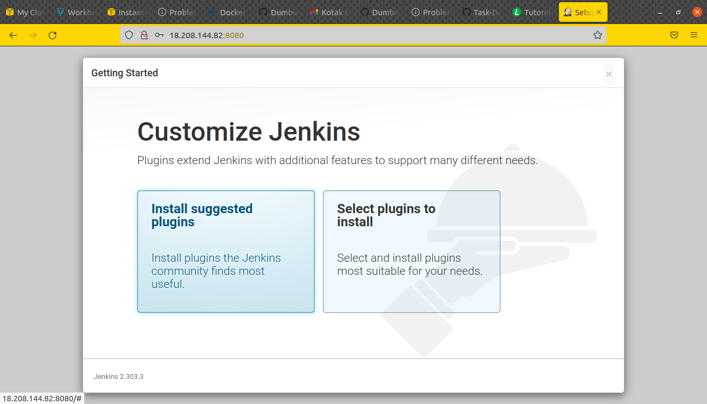  
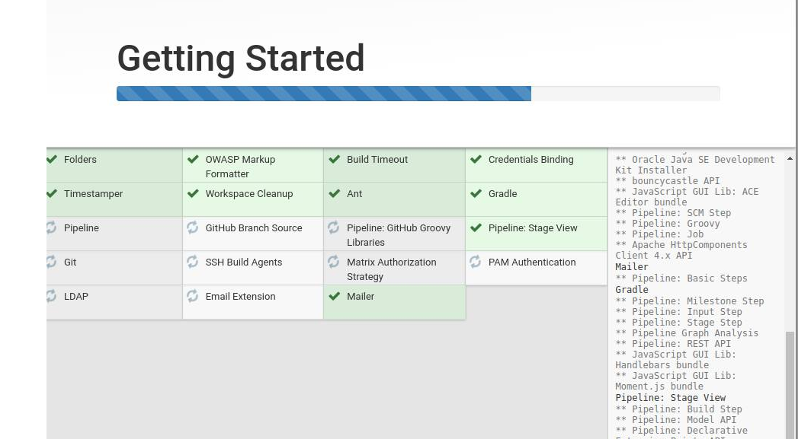   
**4. Create admin jenkins. save and next** 
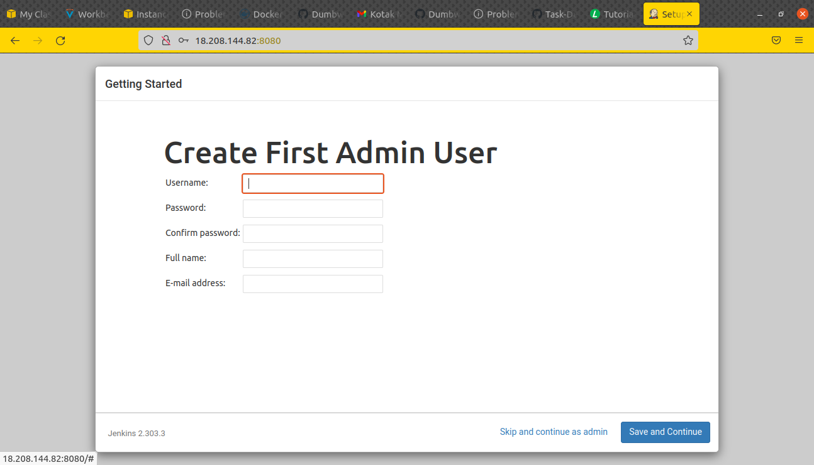   
**5. Konfigurasi jenkins URL. Start.** 
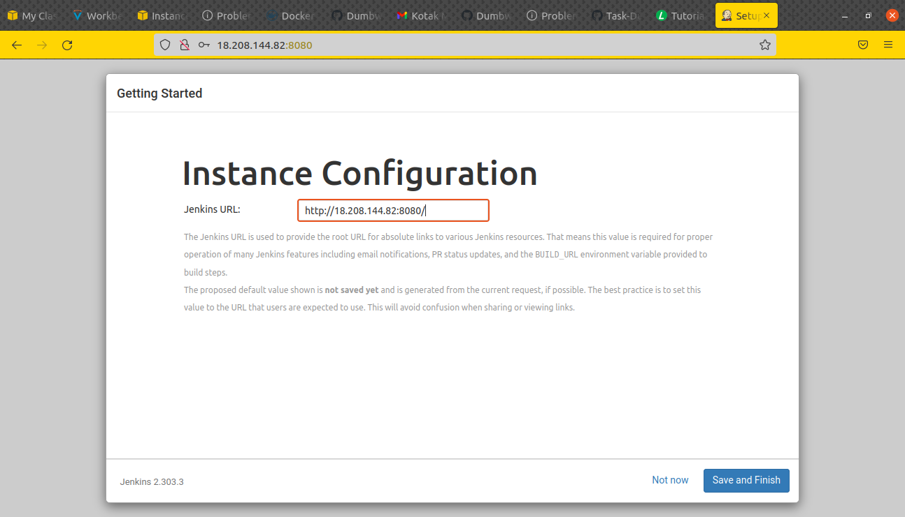   
**6. Halaman dashboard jenkins.** 
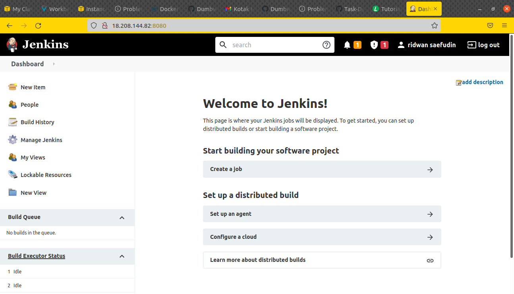   

## Reverse domain for jenkins  
**1. Login akun cloudflare.** 
**2. Pilih akun dan domain.** 
**3. Masuk ke menu DNS.** 
**4. Reverse subdomain untuk jenkins `jenkins.joko.onlinecamp.id`** 
**5. save.** 
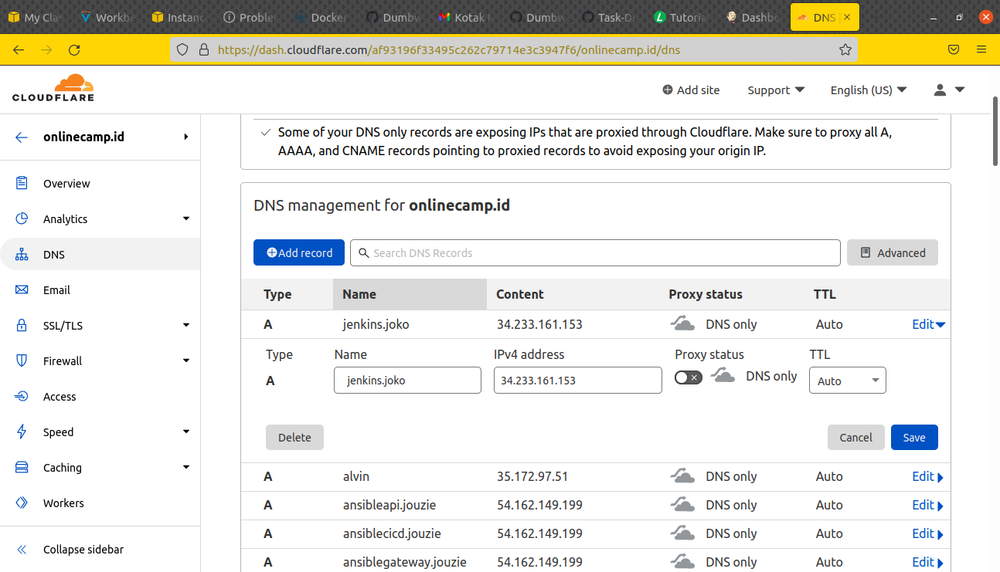   

## Setup Reverse Proxy for Jenkins  
**1. Login ke server gateway.** 
**2. Masuk ke folder nginx `/etc/nginx/`** 
**3. Buat konfigurasi file `jenkins.joko.onlinecamp.id`** 
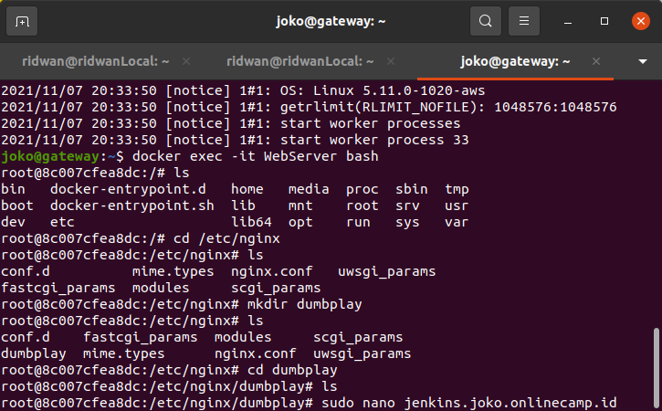  
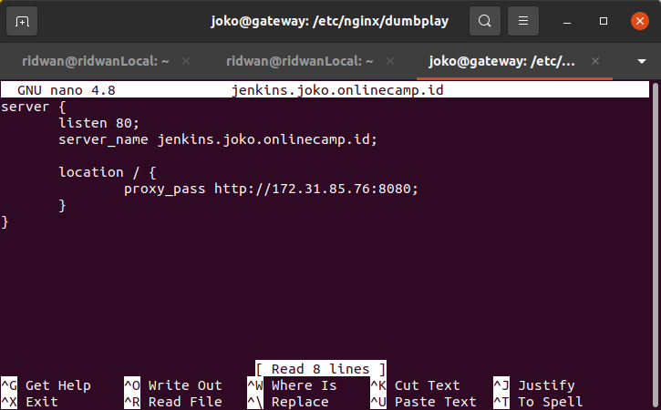   
**4. Simpan, Test `sudo nginx -t`, restart nginx `sudo service nginx restart`** 
**5. Buka browser dan arahkan ke `jenkins.joko.onlinecamp.id`** 
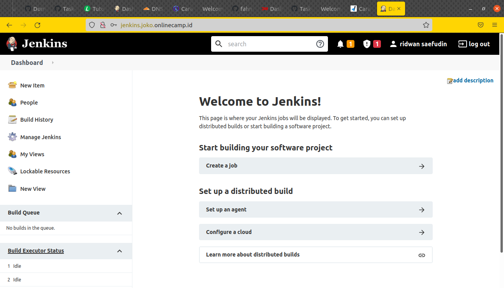   
