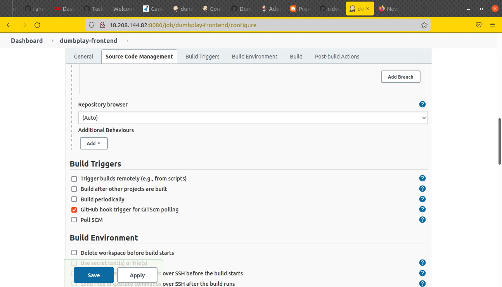

# Setup Jenkins Job
## Requirements  
* Install plugin Publish Over SSH
* Instance/Server app IP address
* aws-ssh-key
* System configuration
  

## Configure System in Jenkins
**1. Install plugin `publish Over SSH`** 
**2. Di halaman Dashboard masuk ke Manage Jenkins** 
**3. Pada System Configuration pilih Configure System** 
**4. Cari publish over ssh** 
   
**5. Copy paste aws key yang digunakan server** 
**6. Beri nama server** 
**7. Masukkan hostname server** 
**8. Input username** 
**9. Beri nilai 0 pada `Timeout (ms)`** 
   
**10. Test koneksi SSH ke server**  

## Create Job  
**1. Login ke server jenkins.** 
**2. klik create a job** 
**3. Masukkan nama project kemudian pilih freestyle project.** 
   
**4. Pada bagian General input deskripsi project(opsional)** 
**5. Di bagian Source code management pilih `Git`** 
**6. Masukkan repository dan branch yang digunakan.** 
   
**7. Untuk Build trigger pilih `Github hook trigger for GITScm polling`** 
   
**8. Pada bagin Build pilih `Send files or execute commands over SSH`** 
**9. Kemudian `Verbose output in console` untuk bisa melihat log buildnya** 
  
   
**10. Di bagian transfer set isi source file, remote directory dan exec command** 
   
**11. Set Execution time jadi 0** 
**12. Setelah itu Apply dan simpan.** 
**13. Build manual dengan klik Build Now.** 
   

## Setup Webhook Github
**1. Login ke akun github** 
**2. Masuk ke halaman settings repository** 
**3. Pilih Webhook** 
**4. Add Webhook** 
**5. Masukkan hostname server jenkins payload URL `http://jenkins.joko.onlinecamp.id/github-webhook/`** 
**6. Kemudian pilih event `just the push event`** 
**7. Checklist Active** 
**8. Simpan Add Webhook.** 
   

## Test Webhook  
**1. Lakukan perubahan pada repository** 
**2. Kemudian push** 
   
**3. Tunggu beberapa saat hingga proses build jenkins selesai** 
**4. Masuk ke jenkins untuk melihat build run atau changes-nya** 
   