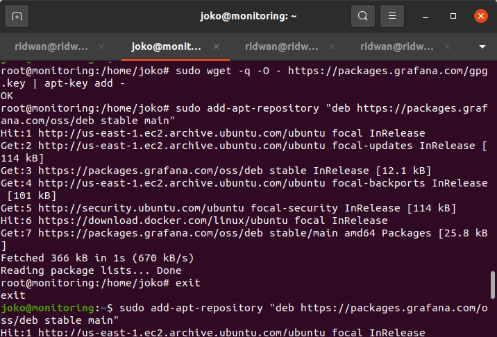

# Setup Monitoring Server

**1. Login ke AWS Console**<br>
**2. Buat instance baru**<br>
**3. Set instance type t2.medium**<br>
**4. Set 16 Gb storage**<br>
**5. Set security group**<br>
**6. Launch instance**<br><br>

## Install Node Exporter di server <br>
**1. Download node exporter**
```
wget https://github.com/prometheus/node_exporter/releases/download/v0.15.2/node_exporter-0.15.2.linux-amd64.tar.gz
```
<br>

 <br><br>

**2. Extract `tar -xf node_exporter-0.15.2.linux-amd64.tar.gz`**<br>
 <br><br>

**3. Pindahkan hasil extract ke /usr/local/bin. `sudo mv node_exporter-0.15.2.linux-amd64 /usr/local/bin`**<br>
 <br><br>

**4. Tambahkan user node_exporter `sudo useradd -rs /bin/false node_exporter`**<br>
**5. Buat Service node_exporter `sudo nano /etc/systemd/system/node_exporter.service`**<br>
 <br>
 <br><br>

**6. Save kemudian reload `sudo systemctl daemon-reload`**<br>
**7. Enable service `sudo systemctl enable node_exporter`**<br>
``` 
Created symlink /etc/systemd/system/multi-user.target.wants/node_exporter.service → /etc/systemd/system/node_exporter.service.
```
<br>

**8. Start node exporter `sudo systemctl start node_exporter`**<br>
**9. Cek status node exporter `sudo systemctl status node_exporter.service`**<br>
 <br><br>

## Install Prometheus di monitoring server <br>
**1. Download prometheus `wget https://github.com/prometheus/prometheus/releases/download/v2.1.0/prometheus-2.1.0.linux-amd64.tar.gz`**<br>
 <br><br>

**2. Extract `tar -xf prometheus-2.1.0.linux-amd64.tar.gz`**<br>
 <br><br>

**3. Masuk ke dalam folder hasil extract prometheus**<br>
**4. Pindahkan folder prometheus dan promtool ke usr/local/bin `sudo mv prometheus promtool /usr/local/bin`**<br>
 <br><br>

**5. Buat folder prometheus di /etc/ dan /var/lib**<br>
```
sudo mkdir /etc/prometheus /var/lib/prometheus

```
<br>

**6. Pindahkan folder dan console_library ke /etc/prometheus `sudo mv consoles console_libraries /etc/prometheus`**<br>
**7. Buat file .yml untuk monitoring server `sudo nano /etc/prometheus/prometheus.yml`**<br>
```
global:
  scrape_interval: 10s

  scrape_configs:
    - job_name: 'prometheus-metrics'
      scrape_interval: 10s
      static_configs:
        - targets: ['localhost:9100']
    - job_name: 'node_exporter_metrics'
      scrape_interval: 5s
       static_configs:
         - targets: ['localhost:9100'] #target server
```
<br>

 <br><br>

**8. Add user prometheus `sudo useradd -rs /bin/false prometheus`**<br>
**9. lalu ubah `sudo chown -R prometheus: /etc/prometheus /var/lib/prometheus`**<br>
**10. Buat service prometheus `sudo nano /etc/systemd/system/prometheus.service`**<br>
 <br>
```
[Unit]
Description=Prometheus 
After=network.target

[Service]
User=prometheus   
Group=prometheus   
Type=simple
ExecStart=/usr/local/bin/prometheus \
    --config.file /etc/prometheus/prometheus.yml \
    --storage.tsdb.path /var/lib/prometheus/ \
    --web.console.templates=/etc/prometheus/consoles \
    --web.console.libraries=/etc/prometheus/console_libraries

[Install]
WantedBy=multi-user.target
```
<br>

 <br><br>

**11. Save dan reload `sudo systemctl daemon-reload`**<br>
**12. Enable service `sudo systemctl enable prometheus`**<br>
```
Created symlink /etc/systemd/system/multi-user.target.wants/prometheus.service → /etc/systemd/system/prometheus.service.
```
<br>

**13. Start prometheus `sudo systemctl start prometheus`**<br>
 <br><br>

**14. Akses ip server monitor melalui port 9090**<br>
 <br><br>

## Install Grafana <br>
**1. Tambahkan key gpg dan apt-repository grafana**<br>
```
wget -q -O - https://packages.grafana.com/gpg.key | sudo apt-key add -
echo "deb https://packages.grafana.com/oss/deb stable main" | sudo tee -a /etc/apt/sources.list.d/grafana.list
```
<br>

 <br><br>

**2. Update dan kemudian install grafana**<br>
```
sudo apt-get update
sudo apt-get install grafana
```
<br>

 <br><br>

**3. Enable grafana `sudo systemctl enable grafana-server`**<br>
**4. Start grafana `sudo systemctl start grafana-server`**<br>
**5. Kemudian cek status grafana `sudo systemctl status grafana-server`**<br>
 <br><br>

## Nonaktifkan Signup grafana <br>
**1. Edit config file grafana.ini `sudo nano /etc/grafana/grafana.ini`**<br>
**2. Pada bagian signup / registration ubah `false` menjadi -> `allow_sign_up = false`**<br>
 <br><br>

**3. Kemudian set `[auth.anonymous]` ke enabled = false**<br>
 <br><br>

**4. Save**<br>
**5. Restart service grafana `sudo systemctl restart grafana-server.service`**<br>
**6. Cek status service grafana `sudo systemctl status grafana-server.service`**
 <br><br>

**7. Akses ip server monitor melalui port 3000**<br>
 <br><br>

**8. Kemudian login dengan user dan password default `admin`**<br>
**9. Setup password baru**<br><br>

## Setup reverse proxy monitoring server <br>
**1. Buat subdomain `monitoring.joko.onlinecamp.id` dan arahkan ke ip server gateway.**<br>
 <br><br>

**2. Login ke server gateway**<br>
**3. Tambahkan config untuk subdomain monitoring di folder conf**<br>
```
    server {
            listen 80;
            server_name monitoring.joko.onlinecamp.id;

            location / {
                    proxy_pass http://172.31.20.220:3000;
            }
    }
```
<br>

**4. Save**<br>
**5. Restart Nginx**<br>
**6. Buka browser akses `monitoring.joko.onlinecamp.id`**<br>
 <br><br>