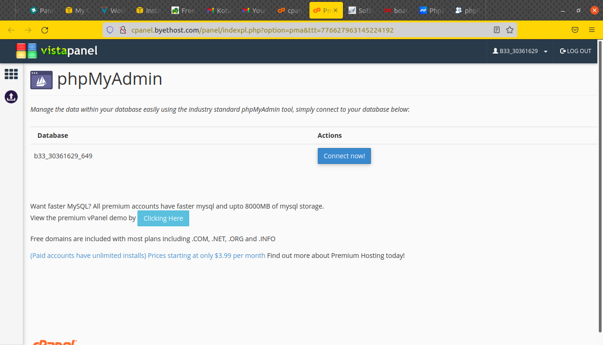

# Deploy PHP in cPanel
### Requirements  
* Hosting with cPanel
* phpBB

## Buat akun di byet.host
**1. Registrasi di byet.host** 
**2. Verifikasi email (cari di spam)** 
**3. Tunggu proses pembuatan akun** 
**4. Setelah itu akan menampilkan informasi akun yang nantinya digunakan untuk login cpanel, sql, dan ftp.** 
  

**5. Login ke cpanel `cpanel.byethost3.com`** 
 
  

**6. Proses pembuatan akun di byet host selesai.**  

## Install phpBB di cpanel  
**1. masuk ke dashboard** 
  

**2. Pada dashboard, pilih dan arahkan ke Suftaculous Apps Installer** 
  

**3. saat masuk ke dalam suftaculous Apps Installer, pilih phpBB**
  

**4. Klik install phpBB** 
**5. Akan diarahkan ke halaman dashboard phpBB** 
  

**6. Setting URL yang digunakan** 
**7. Ubah Board Name dan site Description** 
  

**8. Masukkan username dan password yang akan digunakan** 
  

**9. Klik install** 
**10. Tunggu hingga proses installasi selesai** 
  

**11. Proses installasi selesai dan aplikasi phpBB siap digunakan.**
  

**12. Arahkan URL ke tujuan yang sudah di setting sebelumnya pada saat installasi phpDB** 
  

**13. Cek apakah aplikasi sudah berjalan** 
  

## Buat Database di cPanel  
**1. masuk ke dashboard cpanel** 
**2. arahkan ke phpMyAdmin** 
  

**3. Saat installasi phpBB sebelumnya berjalan, ia akan menginstall plugin-plugin yang dibutuhkan dan juga otomatis membuat databasenya** 
  

**4. Connect ke database** 
**5. Akan diarahkan ke database yang sudah dibuat di phpBB** 
**6. Dan menampilkan isi tabel dari phpBB** 
  
**7. Proses selesai.** 