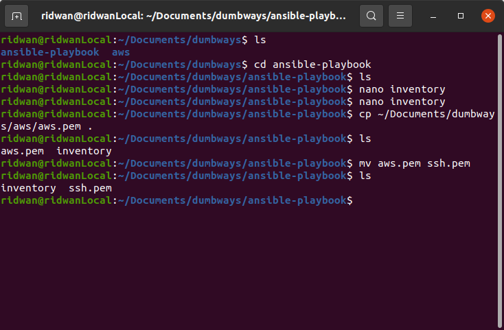
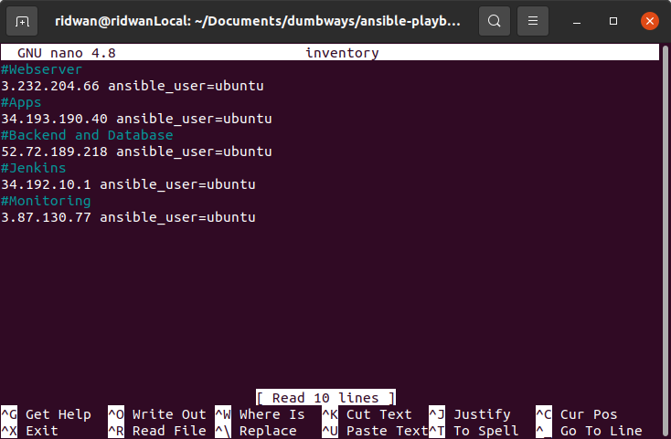

# Setup Server with Ansible
## Requirements: <br>
* Buat repository di github untuk menyimpan file-file ansible
<br>

## Install Ansible in Ubuntu
**1. Konfigurasi PPA**<br>
```
sudo apt update
sudo apt install software-properties-common
sudo add-apt-repository --yes --update ppa:ansible/ansible

```
<br>

<br><br>

**2. Install Ansible `sudo apt install ansible`**<br>
<br><br>

**3. Konfirmasi installasi `ansible all -m ping --ask-pass`**<br><br>

## Define host server <br>
**1. Buat directory untuk mennyimpan file-file ansible**<br>
<br><br>

**2. Masuk ke dalam folder buat file `hosts` untuk menyimpan hostname server**<br>
<br><br>

**3.Ping hosts untuk memastikan koneksi ansible dan server berfungsi `nsible all --key-file ~/path-to/server-aws-key.pem -i hosts -m ping`**<br>
<br><br>

## Setup Custom ansible.cfg file <br>
**1. Buat file `ansible.cfg` di work directory**<br>
**2. Masukkan config berikut**<br>
```
[defaults]
inventory = hosts
private_key_file = ~/Downloads/server-aws-key.pem
```
<br>

<br><br>

**3. Save config**<br><br>

## Ansible-Playbook Setup nginx server <br>
**1. Buat file yml `nginx.yml`**<br>
**2. Buat task update dan upgrade system**<br>
**3. Buat task install nginx**<br>
**4. Berikut adalah yml codenya**<br>
```
---
- name: Setup Nginx
  hosts: 3.232.204.66
  become: true
  tasks:
    - name: Update system
      apt:
        update_cache: yes
    - name: Upgrade system
      apt:
        upgrade: dist

    - name: Install Nginx
      apt:
        name: nginx
        state: present
        update_cache: yes
```
<br>

<br><br>

**5. Save**<br>
**6. Execute perintah `ansible-playbook nginx.yml`**<br>
<br><br>

**7. Check nginx dengan URL**<br>
<br><br>ho