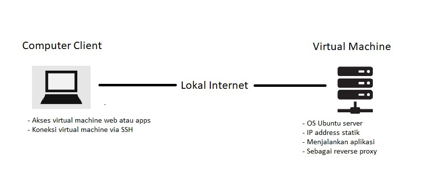

# Task Description
### Task DevOps Week 1 Fundamental DevOps dan Cloud Computing 
 

**1. Devops** 
**DevOps adalah gabungan dari Development dan Operations. Kombinasi tersebut dirancang agar dapat meningkatkan kemampuan sebuah perusahaan untuk proses delivery aplikasi dengan kecepatan tinggi.** 
**Dalam budaya atau ruang lingkup seorang Devops pastinya perlu memahami pemahaman atau familiar dengan sistem Linux. Karena kebanyakan server berjalan menggunakan sistem operasi linux dengan berbagai macam distro.** 
**Pada task week minggu pertama akan dijelaskan step by step mengenai:** 
* Setup virtual machine sebagai server lokal dengan OS Ubuntu Server.
* Setup network dalam virtual machine.
* Setup dan deploy app nodejs
* mengaplikasikan metode reverse proxy.
  
**2. Cloud Computing** 
**Cloud computing adalah proses komputerisasi sebuah teknologi yang berbasis internet. Sistem cloud computing memungkinkan penggunanya untuk menyimpan dan mengolah data secara virtual.** 
**Beberapa penyedia layanan cloud computing seperti Google Cloud Platform(GCP), Amazon Web Service(AWS), Alibaba, OpenShift, dan lain-lain.**  
* Setup Server AWS
* Setup Server untuk Apps.
* Setup Server untuk Reverse Proxy.
* Setup Custom Domain.
* Setup SSL Configuration.*
  
